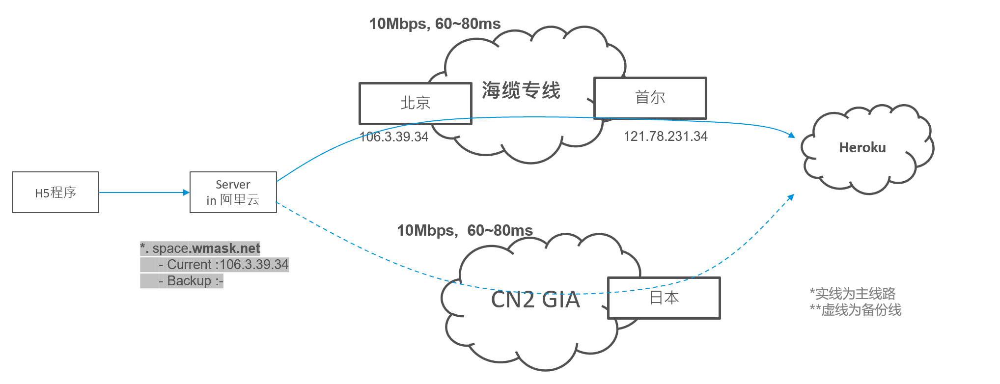

## 加速域名对应关系 

环境| 对外域名 | CNAME | 源站  | 备注
:--- | :--- | :--- | :--- | :---
Stage | heroku-staging.spacecycle.cn | heroku-staging.space.wmask.net | elementary-olive-mpgigygzd3td8e4gf216q6ej.herokudns.com |HTTS 443
生产 | heroku-staging.spacecycle.cn | heroku-staging.space.wmask.net | immense-fortress-8039.peaceful-ridge-1011.herokuspace.com |HTTS 443

<!--
开发 | https://taishan-dev.herokuapp.com | https://taishan-dev.space.wmask.net:4501 | 
测试 | https://taishan-test.herokuapp.com | https://taishan-test.space.wmask.net:4501 | 
UAT | https://taishan-staging.herokuapp.com | https://taishan-staging.space.wmask.net:4501 | 
生产 | https://taishan.herokuapp.com/ | https://taishan.space.wmask.net:4501 | 
-->

## 网络拓扑

仅Heruko部分

